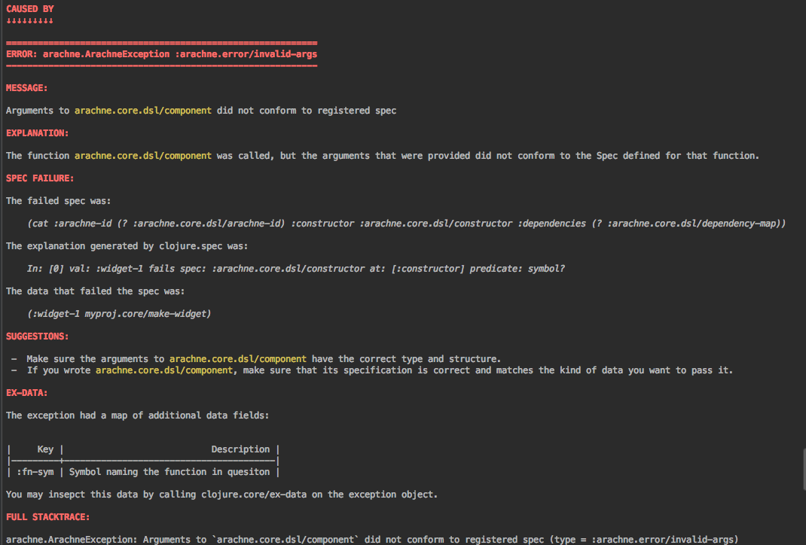

<h1>Creating an Arachne Project</h1>

This in-depth tutorial describes how to create a simple Arachne project from scratch, explaining everything as it goes. You can find the complete source code used in this tutorial on [Github](https://github.com/arachne-framework/arachne-docs/tree/master/tutorial-code/creating-a-project).

In practice, you will probably want to start new Arachne projects using Arachne's project generator, as described on the main [docs page](../index.md). However, when learning Arachne, it is instructive to go through this excercise and create each part piece by piece, to gain an understanding of what the parts are and how they work together.

To make the most of this particular tutorial, you will be most effective if you already:

- Have a basic knowledge of the Clojure language
- Are comfortable with Clojure protocols and records
- Have a Clojure editing environment that you are happy with. You should be able to launch a REPL, create Clojure source files, and evaluate forms from your source files in your REPL.

### Creating the project

For this tutorial, we'll use [leiningen](http://leiningen.org) to assemble our dependencies and launch a JVM.

<aside>
Of course, you can also use Arachne with <a href="http://boot-clj.com/">boot</a> or any other Clojure build tool. We simply use lein for this tutorial since it's the most familiar to the most people.
</aside>

First, let's create a new lein project. At the command line, navigate to a directory of your choice and type `lein new myproj`. This will create a directory called `myproj` containing a `project.clj` file and several stubbed source and test files.

For this tutorial, we will not be using the `/test`, `/doc`, `README.md`, `LICENSE` or `CHANGELOG.md` files, so we will delete them to keep things crystal clear.

After this step, your directory structure should be as follows:

````
myproj
├── project.clj
├── resources
└── src
    └── myproj
        └── core.clj
````

Edit the `project.clj` file to contain the following contents:

````clojure
(defproject myproj "0.1.0-SNAPSHOT"
  :dependencies [[org.clojure/clojure "1.9.0-alpha14"]
                 [org.arachne-framework/arachne-core "<arachne-core-version>"]
                 [datascript "0.15.5"]
                 [ch.qos.logback/logback-classic "1.1.3"]]
  :source-paths ["src" "config"]
  :repositories [["arachne-dev"
                  "http://maven.arachne-framework.org/artifactory/arachne-dev"]])
````

You can just cut and paste for now, but if you're curious about what any of this means:

- Arachne leverages the new `clojure.spec` library heavily, and therefore requires the latest alpha of Clojure 1.9
- The version number for Arachne looks funky. WTF is `<arachne-core-version>` supposed to mean? Well, instead of using SNAPSHOT builds that are effectively mutable and can change underneath you, Arachne's dev builds are named with the following format: `<semver>-<branch>-<commit-idx>-<commit-sha>`. This guarantees that there is a unique version number for each dev build, and you can compare any two versions by looking at the commit-idx: we know that `0081` is newer than `0080` and older than `0082`. Eventually, we'll move to regular release versions, but for now working with dev builds is the best way to stay up-to-date. See the [Versions](../versions.md) page for a list of all the most recent development versions.
- We've included DataScript on the classpath, but we also could have used [Datomic](http://www.datomic.com/get-datomic.html) or [Datomic Free](https://my.datomic.com/downloads/free). Arachne will detect which one is on your classpath and use whatever is present (there is also a way to specify explicitly which to use, if your project includes both Datomic and Datascript.)
- In addition to your project source code, Arachne uses config scripts, conventionally stored in a directory named `config`. If you want these on the classpath, you have to specify this in leiningen.
- Logging is provided by SLF4J, which is compatible with the logging used by most Clojure products (such as Datomic itself.) We can use any concrete logger that supports SLF4J. Logback is merely a common choice.
- We need to add the `arachne-dev` repository explicitly, since Arachne is not yet deployed into Clojars or any other public maven repository.

### Writing a component

Arachne uses Stuart Sierra's "Component" library as the foundation of its runtime system. Component defines a the concept of a "component" (often called a "SierraComponent"), which is a (possibly stateful) object that can be started and stopped, as part of a larger system. SierraComponents can also have dependencies on eachother: more on that in the tutorial on [dependency injection](dependency-injection.md).

To get started with the simplest possible Arachne application, we need to do two things:

- Create a SierraComponent that our system will use
- Define a function which, when called, will return an instance of our component (a "constructor" function, in Arachne parlance)

First, let's pop open `src/myproj/core.clj` and define a component (after requiring a couple namespaces):

````clojure
(ns myproj.core
  (:require [com.stuartsierra.component :as c]
            [arachne.log :as log]))

(defrecord Widget []
  c/Lifecycle
  (start [this]
    (log/info :msg "Hello, world!")
    this)
  (stop [this]
    (log/info :msg "Goodnight!")
    this))
````

This is pretty straightforward; this code simply defines a component that satisfies Component's `Lifecycle` protocol, and logs out a simple message when it is started and stopped, using Arachne's logging utility library.

If you want, at this point, you can verify that your component is working as expected using the REPL:

````clojure
(def w (->Widget))
;;=> #'myproj.core/w
(c/start w)
;;=> #myproj.core.Widget{}
21:29:50.867 [nREPL-worker-5] INFO  myproj.core - {:msg "Hello, world!", :line nil}
````

Now, all that's left is to define a constructor that, when invoked, will return an (unstarted) instance of our SierraComponent, fresh and ready to use:

````
(defn make-widget
  "Constructor for a Widget"
  []
  (->Widget))
````

Great! We're done here. Save the file and let's move on to the next step: creating an Arachne configuration.

### Writing a configuration script

What is an Arachne configuration? Well, it's data that specifies everything about our application that can possibly be specified using data. And it's all in a database. Under the hood, our configuration is stored in a full-fledged, queryable Datomic (or DataScript) database, which makes it extremely powerful for modules to query and update under the hood.

But, building a configuration by directly creating a Datomic database is awkward. It isn't hard, but it's verbose, and not very readable. And since the configuration is what defines the basic structure of our application, we want it to be _super_ readable.

So Arachne provides a DSL (domain specific language) oriented specifically towards writing configuration data. Instead of writing a database, you can just write a namespace containing a _config script_, and when the config namespace is loaded by Arachne, it will populate the config database with everything it needs.

So what does a config namespace look like? For our very simple app, it looks like this:

````clojure
(ns ^:config myproj.config
    (:require [arachne.core.dsl :as a]))

(a/id :myproj/widget-1 (a/component 'myproj.core/make-widget))

(a/id :myproj/runtime (a/runtime [:myproj/widget-1]))
````

Save this to a file called `config/myproj/config.clj` in your project directory.

There are two things worth unpacking here, before we dive into what these forms mean.

First, you will notice that the namespace has some `^:config` metadata. This is to signal that although it is a valid Clojure namespace, it is _not part of your project's codebase_. It is a config script, and serves a different purpose than does a standard Clojure namespace.

In a very real sense, your config script is an entirely separate mini-program that has only one job: generating a config. Your *real* application will read that config and execute an application based on it. We happen to be using the same JVM for both programs, here, and using an "in memory" only config, because it's convenient. But it's theoretically possible to evaluate a config script, store the resulting config in a persistent database, shut down your computer, and then hand the config to an application and have it run at some point in the distant future.

This is also why the config code is in a separate directory, which we have added to the classpath in `project.clj`. This further emphasizes its separation from the main application codebase.

Second, you can't evaluate these forms at the REPL. Sorry. This is because each time one of these config DSL forms is evaluated, it updates the "current configuration" (stored in an atom in a dynamic var, if you're curious how that works.) If you're just in a regular old REPL, there _is_ no current configuration, and so trying to call a DSL form will throw an error. So you can't just require a config namespace from anywhere: Arachne needs to control the loading of config namespaces and make sure the correct environment is set up.

With that out of the way, let's talk about what these functions do.

`arachne.core/id` assigns an "Arachne ID" (a qualified keyword) to a an entity in the config. Arachne IDs are used pervasively to provide a human and machine-readable name to refer to config entities.

The `arachne.core.dsl/component` function defines a component, in the configuration. The argument is a quoted symbol, identifying the constructor function to use when actually creating the component instance. Understand, the config DSL function only *identifies* the constructor function; it isn't called yet! It's merely stored in the config, to be used when your app finally starts.

Then, we use `arachne.core/id` on the return value to name the component we just created, giving it an Arachne ID of `:myproj/widget-1`. So anywhere else we refer to `:myproj/widget-1`, we will be referring to that same config entity.

The `arachne.core.dsl/component` function also takes an optional second argument, to specify the dependencies of the component, but we'll ignore that for now.

The `arachne.core.dsl/runtime` function defines a named _runtime entity_ in the application's configuration. The runtime entity groups components together and specifies which ones should be instantiated when an Arachne program starts. When we actually run our program, we'll see that we have to tell Arachne which runtime we want to use, which in turn indicates the set of components that we want started.

In this case we just have one runtime (named `:myproj/runtime`), which identifies our one and only component (`:myproj/widget-1`). But as applications get larger and more complex, it can be very useful to have multiple runtimes in the same config. For example, two different but related services could be defined in the same Arachne config, but have completely different runtimes, and do completely different things when started.

### Application metadata

Finally, we have to tell Arachne some metadata about our application: what its name is, what modules it depends on, and where our config script is located.

To do this, we need write an `arachne.edn` file, somewhere on our classpath, that contains this information. Let's put it in `/resources` for now:

````clojure
[{:arachne/name :myproj/app
  :arachne/inits [myproj.config]
  :arachne/dependencies [:org.arachne-framework/arachne-core]}]
````

- `:arachne/name` is just the name of our application as a whole.
- `:arachne/inits` is a vector of  "initializers" to use. Initializers come in many flavors (for example, you can pass in raw Datomic transactions to the config) but here, we're just going to give it the name of the config namespace that we wrote in the previous section.
- `:arachne/dependencies` specifies the module names of the Arachne modules that we want to depend on. For this rudimentary example, that's just the core module, named `:org.arachne-framework/arachne-core`. All the modules we want to use must also be on the classpath (that is, specified in our `project.clj`, which `arachne.core` is.)

That's it! Our Arachne application is now ready to run.

At this point, your project directory structure should look like this:

````
myproj
├── config
│   └── myproj
│       └── config.clj
├── project.clj
├── resources
│   └── arachne.edn
└── src
    └── myproj
        └── core.clj
````

### Running the application

There are two ways to run an Arachne application:

- From the REPL, as you would during development
- From the command line, as you might in production

#### Running from the REPL

With a REPL open, start by requiring the namespaces we'll need to get things rolling:

````clojure
(require '[arachne.core :as arachne])
(require '[com.stuartsierra.component :as c])
````

Then, we can build a configuration value:

````clojure
(def cfg (arachne/config :myproj/app))
;; => #'user/cfg
````

Inside this seemingly simple function call, a _huge_ number of things are happening under the hood.

1. We pass in only the name of our application, `:myproj/app`
2. The application metadata is loaded from the `arachne.edn` file.
3. A new config is built, using schema derived from all the modules that we depend on.
3. Our config script is evaluated (you can put some `println`s in it, if you like, to prove to yourself that this is the case)
4. All the modules that we required are doing their thing, adding their own data to the config, and possibly querying and manipulating the data that we added.

The value that is returned is a configuration object: an immutable, in-memory database.

So far, we haven't actually started anything yet. To do that, we initialize a runtime using the config we just built:

````clojure
(def rt (arachne/runtime cfg :myproj/runtime))
;; => #'user/rt
````

What just happened? We gave the runtime initializer the configuration we want to use, and the Arachne ID of the runtime entity, within the config (remember)? What we got back was an initialized, but unstarted Arachne runtime object.

All of our constructor functions have been called (try putting a `println` in the constructor function to convince yourself that this is true), but we haven't yet called Component's `start` method on our system, so nothing's actually happened yet. '

Let's run it!

````clojure
(def started-rt (c/start rt))
=> #'user/started-rt
````

Note that it's important to capture the result of calling `start`; we'll need it to pass to `stop` if we ever want to stop our system.

In our console, we should also see two log messages:

````
22:27:18.671 [nREPL-worker-20] INFO  arachne.core.runtime - {:msg "Starting Arachne runtime", :line nil}
22:27:18.675 [nREPL-worker-20] INFO  myproj.core - {:msg "Hello, world!", :line nil}
````

One is the log message that Arachne spits out when it starts; the other is the log message from our component. It worked! We now have a full (if small) Arachne system running on our machine.

You can call `stop` on the runtime when you're done:

````clojure
(c/stop started-rt)
22:33:23.754 [nREPL-worker-21] INFO  arachne.core.runtime - {:msg "Stopping Arachne runtime", :line nil}
22:33:23.754 [nREPL-worker-21] INFO  myproj.core - {:msg "Goodnight!", :line nil}
````

There are a few gotchas to remember when doing REPL-driven development with Arachne:

1. If you change anything in your config script, you'll need to stop your runtime and rebuild your config from `(arachne.core/config)`. The config that it returns is immutable, and can't be updated once it's been used to start a runtime.
2. If you change the code you use to define your component definitions, you'll have to re-initialize your runtime to see the changes, starting from `(arachne.core/runtime)`. Changing the definition of a component won't change the instances that are referenced inside the runtime object.

In the future, we plan to release dev tools that will watch source files and config scripts for changes and do some of these things automatically, but for now it's the responsibility of users to keep track of them.

#### Running from the command line

Running from the command line is, fortunately, even more straightforward. Arachne defines an `arachne.run` namespace, which contains a `-main` method that can be used to easily launch an Arachne application.

You can set `arachne.run` as the default `:main` namespace in leiningen by adding the following key to your `project.clj`:

````clojure
:main arachne.run
````

Then, you can start your Arachne application from the command line by calling `lein run` and passing it two arguments: the name of your application as defined in `arachne.edn`, and the name of the runtime you want to start as defined in your init script:

````bash
lein run :myproj/app :myproj/runtime
22:46:01.744 [main] INFO  arachne.run - {:msg "Launching Arachne application", :name ":myproj/app", :runtime ":myproj/runtime", :line nil}
22:46:03.498 [main] INFO  arachne.core.runtime - {:msg "Starting Arachne runtime", :line nil}
22:46:03.507 [main] INFO  myproj.core - {:msg "Hello, world!", :line nil}
````

You should see the same log messages, indicating that the application (including your component) has started correctly.

You will need to terminate the program manually when you're done, since it won't exit by itself.

## Error reporting

There is one final thing you should be aware of when developing an Arachne application: its enhanced error reporting tools.

To see what happens when something goes wrong, lets tweak our config script to pass an invalid name for our component: a keyword with no namespace:

````clojure
(a/id :widget-1 (a/component 'myproj.core/make-widget))
````

When we try to build a config based on this script, it throws an exception:

````clojure
(def cfg (arachne/config :myproj/app))
;;CompilerException arachne.ArachneException: Arguments to `arachne.core.dsl/id` did not conform to registered spec (type = :arachne.error/invalid-args), compiling:(myproj/config.clj:4:1)
````

This should look quite familiar to anyone who has experience with Clojure development... in that it isn't very helpful. Of course we can obtain a bit more information with some digging...

````
(.printStackTrace *e)

arachne.ArachneException: Error initializing module `:myproj/app` (type = :arachne.core.module/error-in-initializer)
	at arachne.error$arachne_ex.invokeStatic(error.clj:132)
	at arachne.error$arachne_ex.invoke(error.clj:123)

   <SNIP MANY MANY LINES>

	at arachne.core.module$initialize$fn__4038.invoke(module.clj:162)
	... 51 more
Caused by: arachne.ArachneException: Arguments to `arachne.core.dsl/id` did not conform to registered spec (type = :arachne.error/invalid-args)
	at arachne.error$arachne_ex.invokeStatic(error.clj:132)
	at arachne.error$arachne_ex.invoke(error.clj:123)
	at arachne.error$assert.invokeStatic(error.clj:60)
	at arachne.error$assert.invoke(error.clj:53)
	at arachne.error$assert_args.invokeStatic(error.clj:73)
	at arachne.error$assert_args.doInvoke(error.clj:66)
	at clojure.lang.RestFn.applyTo(RestFn.java:139)
	at clojure.core$apply.invokeStatic(core.clj:659)
	at clojure.core$apply.invoke(core.clj:652)
	at arachne.core.dsl$id.invokeStatic(dsl.clj:47)
	at arachne.core.dsl$id.doInvoke(dsl.clj:47)
	at clojure.lang.RestFn.invoke(RestFn.java:421)
	at myproj.config$eval9782.invokeStatic(config.clj:4)
	at myproj.config$eval9782.invoke(config.clj:4)
	at clojure.lang.Compiler.eval(Compiler.java:6978)
	at clojure.lang.Compiler.load(Compiler.java:7430)
	... 78 more
nil
````

If you manage to read through all that, you might eventually discover something helpful: it looks like there was something wrong with the arguments to `arachne.core.dsl/id`. Fine.

Fortunately, with Arachne, there is a slightly better alternative: invoke `(arachne.error/explain)`, with no arguments, at the REPL. This will produce a pretty-printed view of the last top-level exception (the onecurrently bound to `*e`, in Clojure's REPL).

The output of `explain` is still extremely verbose. It still lists the full stacktrace because, well, sometimes you need that. However, it is colored and highlighted in such a way that with a bit of scrolling you will eventually see something like this:



Hopefully, you find this to be a better alternative.

One of Arachne's goals is to provide good error messages, so if you find an error that is unhelpful or confusing, please consider it a bug and file an issue: we would love to get to a point where all error messages are not only clear and helpful, but illuminating on how the system as a whole is supposed to work.

